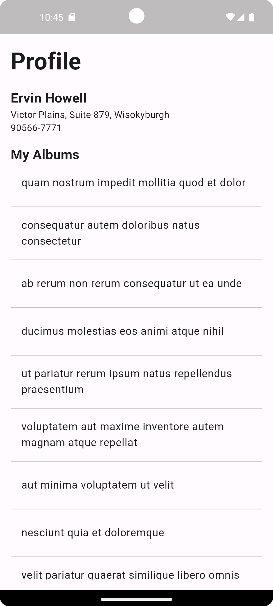
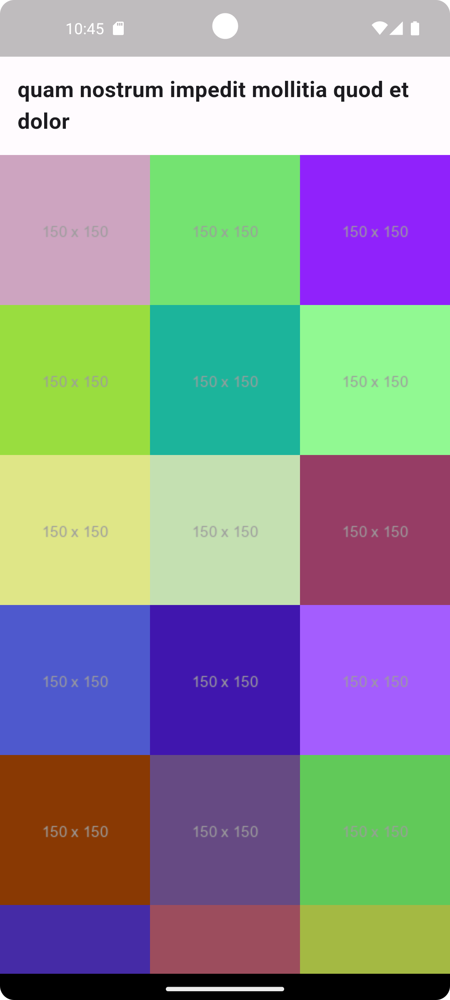

# Task

this task was implemented first with `cubit` in this [branch](https://github.com/moha-b/ATW-Task/tree/cubit) because it's too simple to implement with `bloc` but I make it anyway in the main branch and there is another approach smiler to `cubit` implementation in this [branch](https://github.com/moha-b/ATW-Task/tree/bloc)

# API Endpoints:
* Base URL : [jsonplaceholder](https://jsonplaceholder.typicode.com) 
* User : GET /users you can pick any user to start with (I pick user number 2) 
* Albums : GET /albums (userId as a parameter) 
* Photos : GET /photos (albumId as a parameter) 

# Screens

